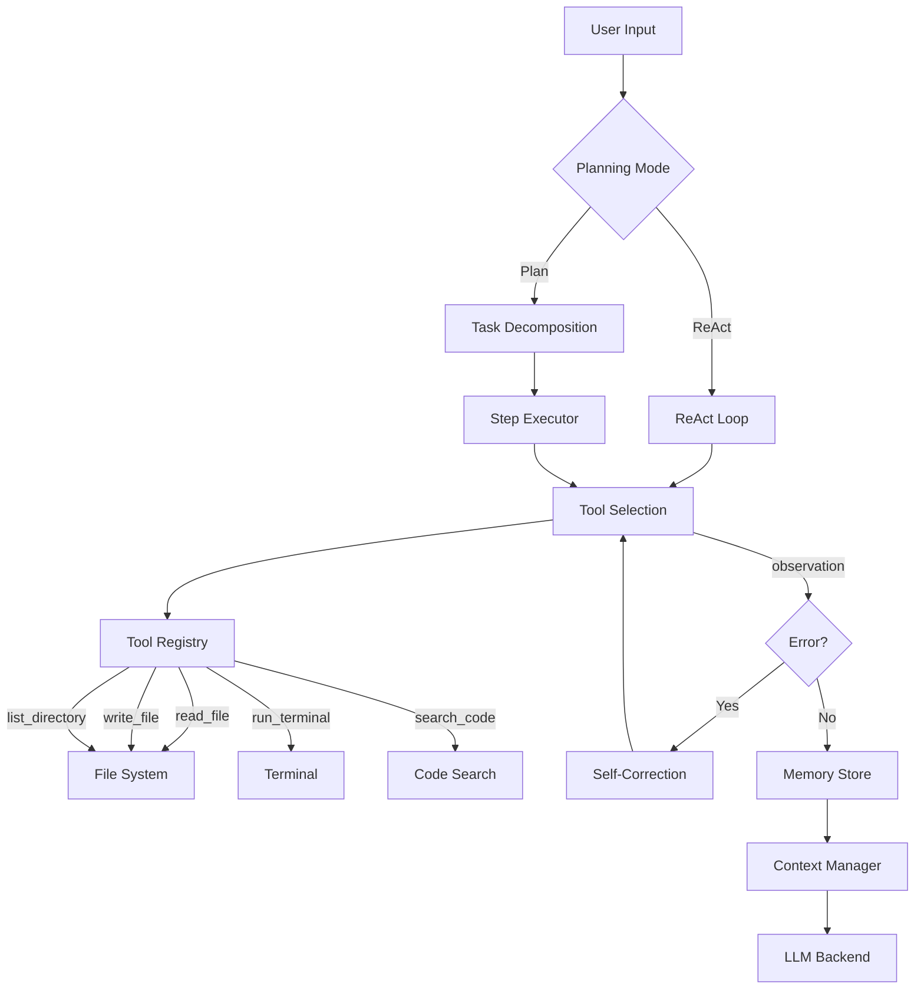

# Coder-Agent — 详细执行计划

## 项目定位

**AI Coding Assistant with ReAct Planning, Tool Use, Self-Correction, and Systematic Evaluation**

核心卖点：不是套API做chatbot，而是从底层实现一个具备planning、tool use、memory、self-correction能力的coding agent，并用标准benchmark量化效果。

---

## 当前状态

- 本地模型多轮对话 ✓
- 注册工具脚本可调用修改本地文件 ✓
- Plan模式 ✓

需要升级的方向：ReAct框架、更多工具、self-correction loop、memory系统、evaluation框架、工程化包装。

---

## 总体时间线：10-12天

| 阶段 | 天数 | 内容 |
|------|------|------|
| Phase 1 | Day 1-3 | ReAct框架 + Tool Use增强 + Self-Correction |
| Phase 2 | Day 4-5 | Memory与Context管理 |
| Phase 3 | Day 6-8 | Evaluation框架 + 跑benchmark |
| Phase 4 | Day 9-10 | 工程化 + CLI + 文档 |
| (Optional) | Day 11-12 | Multi-backend + 高级特性 |

---

## Phase 1: ReAct框架 + Tool Use + Self-Correction（Day 1-3）

### Day 1: 将现有Plan模式升级为ReAct

**上午：实现ReAct核心循环**

当前的plan模式是"先规划再执行"，ReAct是"边想边做"——Thought → Action → Observation交替进行，更适合编码任务中的动态调整。

核心循环：
```
while not task_complete and steps < max_steps:
    thought = llm.think(task, history)      # 推理当前该做什么
    action = llm.decide_action(thought)      # 选择工具和参数
    observation = execute_tool(action)        # 执行工具，获取结果
    history.append(thought, action, observation)
    task_complete = llm.check_done(history)   # 判断是否完成
```

关键设计点：
- 每一步的thought、action、observation都记录到trajectory
- max_steps设为15（防止无限循环）
- 支持两种模式切换：ReAct模式（边想边做）和Plan-Execute模式（先整体规划）

**下午：实现structured tool calling**

将现有的工具调用改为structured format：
```json
{
  "tool": "write_file",
  "args": {"path": "main.py", "content": "..."},
  "reason": "Creating the entry point"
}
```

- LLM输出JSON格式的tool call
- 实现robust的JSON解析（处理LLM输出不完整JSON的情况）
- 工具调用结果也结构化返回：成功/失败 + 输出内容 + 错误信息

**关键产出：** ReAct循环可运行，structured tool calling可用

### Day 2: 扩展工具集

**上午：实现核心工具（5个）**

| 工具 | 功能 | 输入 | 输出 |
|------|------|------|------|
| read_file | 读取文件内容 | path | 文件内容或错误 |
| write_file | 写入/创建文件 | path, content | 成功/失败 |
| run_terminal | 执行shell命令 | command, timeout | stdout, stderr, exit_code |
| list_directory | 查看目录结构 | path, depth | 文件树 |
| search_code | grep搜索代码 | pattern, path, flags | 匹配行列表 |

每个工具需要：
- 输入参数校验
- 超时控制（run_terminal默认30秒）
- 安全限制（禁止rm -rf /等危险命令）
- 结构化错误返回

**下午：实现工具注册机制**

- 工具通过装饰器注册：
```python
@tool(name="read_file", description="Read file content")
def read_file(path: str) -> ToolResult:
    ...
```
- 自动生成工具描述供LLM参考（类似function calling的schema）
- 支持动态添加/移除工具
- 工具列表作为system prompt的一部分注入LLM

**关键产出：** 5个核心工具 + 可扩展的工具注册系统

### Day 3: Self-Correction Loop

**上午：实现错误检测和自动修复**

核心流程：
```
write_code → run_code → 检查结果
  ├─ 成功 → 继续下一步
  └─ 失败 → 分析错误 → 修复代码 → 重新运行（最多3次）
```

实现细节：
- 捕获run_terminal的stderr和exit_code
- 将错误信息（traceback）反馈给LLM
- LLM分析错误原因，决定修复策略
- 修复后重新运行，记录retry次数
- 3次失败后停止，向用户报告失败原因

**下午：实现代码验证步骤**

在self-correction loop中加入主动验证：
- 写完代码后自动运行 `python -m py_compile` 检查语法
- 如果项目有tests，自动运行 `pytest` 检查
- 将验证结果作为observation反馈给ReAct循环

记录trajectory中的关键指标：
- 每个任务的retry次数
- 每次retry的错误类型
- 最终是否成功

**关键产出：** Self-correction loop + 代码验证 + trajectory记录

---

## Phase 2: Memory与Context管理（Day 4-5）

### Day 4: Context Window管理

**上午：实现智能context截断**

问题：编码任务中context很容易超出token限制（文件内容、terminal输出、历史对话都很长）。

解决方案：
- 实现token计数器（用tiktoken或简单估算）
- 当context接近上限时，执行压缩策略：
  1. 对旧的observation做摘要（用LLM一句话总结长输出）
  2. 只保留最近N步的完整trajectory，更早的只保留thought
  3. 文件内容只保留相关片段而非全文
- 优先级：最近的action > 错误信息 > 文件内容 > 早期history

**下午：实现conversation摘要**

- 当对话超过一定长度，自动生成"到目前为止做了什么"的摘要
- 摘要替换掉详细的早期history
- 保留关键信息：已创建的文件、已完成的任务、当前状态

**关键产出：** Context不会溢出，长任务可以持续执行

### Day 5: Long-term Memory + Codebase Indexing

**上午：Long-term Memory（SQLite）**

用SQLite存储跨session的信息：
```sql
-- 项目信息表
CREATE TABLE projects (
    id TEXT PRIMARY KEY,
    path TEXT,
    description TEXT,
    tech_stack TEXT,
    last_accessed TIMESTAMP
);

-- 文件摘要表
CREATE TABLE file_summaries (
    project_id TEXT,
    file_path TEXT,
    summary TEXT,
    last_modified TIMESTAMP
);

-- 用户偏好表
CREATE TABLE preferences (
    key TEXT PRIMARY KEY,
    value TEXT
);
```

- Agent首次进入项目时，扫描目录结构并生成项目摘要
- 后续session可以直接读取，不用重新分析
- 记录用户的编码风格偏好（如tab vs spaces、命名规范等）

**下午：简单的Codebase Indexing**

- 用Python AST模块解析项目中的.py文件
- 提取：类名、函数名、函数签名、docstring
- 存入file_summaries表
- 支持语义查询："找到处理用户认证的函数"
  → 在function signatures和docstrings中做关键词匹配
  → 返回相关文件和函数位置

注意：不做embedding-based索引（那是RAG项目的领域），这里只做AST-level的结构化索引，保持简单。

**关键产出：** SQLite memory + AST-based codebase index

---

## Phase 3: Evaluation框架（Day 6-8）

### Day 6: HumanEval Benchmark接入

**上午：搭建evaluation pipeline**

- 下载HumanEval数据集（164个Python编程题）
- 实现评估流程：
  1. 读取problem description
  2. 让agent生成solution
  3. 运行provided test cases
  4. 记录pass/fail
- 计算pass@1（一次生成就通过的比例）

**下午：跑第一轮baseline**

- 不开启self-correction，跑一遍HumanEval
- 开启self-correction（max retry=3），再跑一遍
- 对比：self-correction提升了多少pass@1？
- 记录每道题的：
  - 是否通过
  - 尝试次数
  - 每次的错误类型
  - 总耗时

**关键产出：** HumanEval pass@1 baseline（有/无self-correction）

### Day 7: 自定义Multi-step Task Suite

**上午：设计10-15个multi-step编码任务**

HumanEval是单函数题，不能体现agent的tool use和planning能力。需要自己设计更复杂的任务。

任务设计原则：
- 每个任务需要多步操作（3-8步）
- 需要使用多种工具
- 有明确的验证标准

示例任务：
```yaml
- name: "Create REST API"
  description: "Create a Flask REST API with /users endpoint supporting GET and POST, with input validation, error handling, and unit tests"
  required_tools: [write_file, run_terminal, read_file]
  verification:
    - "pytest tests/ passes"
    - "curl localhost:5000/users returns 200"
    - "POST with invalid data returns 400"
  max_steps: 15
  difficulty: medium

- name: "Debug and Fix"
  description: "The file buggy_sort.py has 3 bugs. Find and fix all bugs so that all tests pass."
  setup_files: ["buggy_sort.py", "test_sort.py"]
  required_tools: [read_file, write_file, run_terminal, search_code]
  verification:
    - "pytest test_sort.py passes"
  max_steps: 10
  difficulty: easy

- name: "Refactor Module"  
  description: "Refactor the monolithic utils.py (300 lines) into separate modules with proper imports. All existing tests must still pass."
  setup_files: ["utils.py", "test_utils.py"]
  required_tools: [read_file, write_file, list_directory, run_terminal]
  verification:
    - "utils.py no longer exists"
    - "pytest test_utils.py passes"
  max_steps: 20
  difficulty: hard
```

**下午：实现task runner**

- 读取YAML任务定义
- 自动setup（创建测试文件等）
- 运行agent
- 执行verification checks
- 记录完整trajectory

**关键产出：** 10-15个自定义任务 + 自动化task runner

### Day 8: 跑全量评估 + Trajectory分析

**上午：跑所有实验**

实验矩阵：
| 配置 | Planning | Self-Correction | Memory |
|------|----------|-----------------|--------|
| C1 | 无（直接生成） | ✗ | ✗ |
| C2 | ReAct | ✗ | ✗ |
| C3 | ReAct | ✓ (max 3) | ✗ |
| C4 | ReAct | ✓ (max 3) | ✓ |

在HumanEval + 自定义任务上都跑一遍

**下午：Trajectory分析**

统计关键指标：
- 平均步骤数 per task
- Tool调用分布（哪个工具用得最多）
- Self-correction触发率
- Self-correction成功率（retry后修复的比例）
- 平均每个任务的token消耗
- 任务完成率 by difficulty level

生成分析报告：
- 哪类任务agent最擅长/最不擅长？
- Self-correction在什么类型的错误上最有效？
- Planning对复杂任务的影响有多大？

**关键产出：** 完整实验数据 + trajectory分析报告

---

## Phase 4: 工程化 + CLI + 文档（Day 9-10）

### Day 9: CLI工具 + 配置系统

**上午：用click/argparse做CLI**

```bash
# 交互模式
coder-agent chat --model local --project ./my-project

# 单任务模式
coder-agent run "Create a Flask API with user auth" --project ./my-project

# 评估模式
coder-agent eval --benchmark humaneval --output results/
coder-agent eval --benchmark custom --task-dir tasks/ --output results/

# 查看项目记忆
coder-agent memory --project ./my-project
```

**下午：YAML配置系统**

```yaml
# config.yaml
model:
  provider: local          # local / openai / anthropic
  name: qwen2.5-coder     # 本地模型名
  temperature: 0.2
  max_tokens: 4096

agent:
  max_steps: 15
  max_retries: 3
  planning_mode: react     # react / plan-execute
  enable_memory: true

tools:
  terminal_timeout: 30
  blocked_commands: ["rm -rf /", "sudo"]
  
context:
  max_tokens: 8000
  summary_threshold: 6000  # 超过这个值开始压缩
```

**关键产出：** CLI可用 + 配置化

### Day 10: GitHub包装

**上午：README撰写**

结构：
1. 项目简介 + Architecture Diagram
2. 功能演示 GIF（录一个30秒的terminal demo）
3. Quick Start（pip install + 3行代码开始用）
4. 支持的工具列表
5. 配置说明
6. Evaluation结果表格
   - HumanEval pass@1 对比
   - 自定义任务完成率
   - Trajectory统计
7. 设计决策说明（为什么选ReAct、为什么max retry=3等）

Architecture Diagram（Mermaid）：


**下午：代码清理**

- 添加type hints
- 关键函数添加docstrings
- 确保 `pip install -e .` 可用
- 写 `pyproject.toml` 或 `setup.py`
- 确保 `coder-agent --help` 输出清晰

**关键产出：** 完整GitHub项目，可以demo

---

## Optional: Day 11-12

### 选项A：Multi-backend支持（推荐度：高）

支持多种LLM后端：
- 本地模型（通过ollama或vllm）
- OpenAI API
- Anthropic API

通过config.yaml切换，代码层面用统一接口封装：
```python
class LLMBackend:
    def generate(self, messages, tools=None) -> Response: ...

class LocalBackend(LLMBackend): ...
class OpenAIBackend(LLMBackend): ...
class AnthropicBackend(LLMBackend): ...
```

然后用不同后端跑HumanEval，对比本地模型 vs API模型的效果差异。这个对比数据在面试时非常有话题。

### 选项B：Streaming输出（推荐度：中）

让agent的思考和执行过程实时输出：
- Thought: "I need to read the existing code first..." 
- Action: read_file("main.py")
- Observation: [file content]
- Thought: "I see the bug is in line 42..."

这提升用户体验，也方便debug agent行为。

### 选项C：技术博客（推荐度：高）

和RAG项目类似，写一篇：
"Building a Coding Agent from Scratch: What I Learned About Planning, Tool Use, and Self-Correction"

覆盖：
- 为什么选ReAct而不是Plan-Execute
- Self-correction的成功率和局限性
- Context window管理的实际挑战
- HumanEval结果和分析

---

## 技术栈总结

| 组件 | 选型 |
|------|------|
| 核心框架 | 纯Python自实现（不依赖LangChain） |
| LLM | 本地模型 (Ollama) + OpenAI/Anthropic API |
| Planning | ReAct (自实现) |
| Tool调用 | 自定义tool registry + JSON schema |
| Memory | SQLite |
| Codebase Index | Python AST模块 |
| Context管理 | tiktoken + 自实现压缩 |
| CLI | click |
| 配置 | PyYAML |
| 评估 | HumanEval + 自定义task suite |
| 录屏 | asciinema（生成终端GIF） |

重要：这个项目故意不用LangChain/LlamaIndex，全部自实现。面试时这是加分项——"我从底层理解agent的每个组件是怎么工作的"。

---

## 面试时的讲述框架（3分钟版）

**开头（30秒）：** "我从底层构建了一个AI coding assistant，基于ReAct框架实现planning，支持5种工具调用，具备self-correction能力，并用HumanEval和自定义multi-step任务做了系统性评估。"

**技术细节（1分钟）：** "核心是一个ReAct循环——agent每一步先推理当前状态，选择合适的工具执行，观察结果后决定下一步。关键设计是self-correction：当代码运行出错时，agent会分析traceback，修复代码并重试，最多3次。在HumanEval上，self-correction将pass@1从X%提升到Y%，主要解决的是syntax error和edge case遗漏。"

**深度展示（1分钟）：** "在trajectory分析中发现几个有趣的模式：agent平均需要Z步完成一个multi-step任务，其中约W%的步骤是correction步骤。Self-correction对TypeError和IndexError的修复成功率最高（约80%），但对逻辑错误的修复率较低（约30%）。另外，context window管理是一个实际挑战——长任务到后期如果不做摘要压缩，agent会因为丢失早期context而重复已做过的步骤。"

**收尾（30秒）：** "这个项目让我深入理解了agent系统的核心挑战：planning的粒度如何选择、tool call的可靠性如何保证、context window如何管理、以及如何系统性地评估agent的能力边界。"

---

## 和RAG项目的时间协调

如果两个项目并行：

| 周 | Coder-Agent | RAG Benchmark |
|---|---|---|
| Week 1前半 | Phase 1 (ReAct + Tools + Correction) | Phase 1后台跑索引构建 |
| Week 1后半 | Phase 2 (Memory) | Phase 2 (Hybrid + Reranker) |
| Week 2前半 | Phase 3 (Evaluation) | Phase 3-4 (Query Expansion + 全量实验) |
| Week 2后半 | Phase 4 (工程化) | Phase 5 (Error Analysis) |
| Week 3 | Optional improvements | Phase 6 (前端 + 文档) |

建议优先级：Coder-Agent先做到Phase 3能跑evaluation，然后切到RAG项目集中推进，最后回来做Coder-Agent的Phase 4包装。
