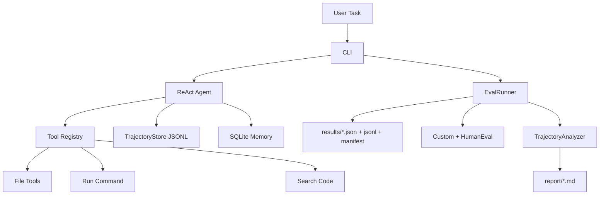

# Coder-Agent

ReAct-based coding agent with tool use, trajectory logging, and a demoable evaluation pipeline.

基于 ReAct 的 coding agent，支持工具调用、trajectory 记录，以及可演示的评测闭环。

## Status / 当前状态

The project currently supports:

- interactive chat and single-task execution / 交互式与单任务执行
- custom benchmark evaluation / 自定义任务评测
- HumanEval subset evaluation / HumanEval 子集评测
- namespaced compare runs / 带命名空间的对比实验
- resumable long-running eval jobs / 支持断点恢复的长跑评测
- Markdown eval reports under `report/` / `report/` 目录下的 Markdown 评测报告

Current eval reports:

- [EVAL_BATCH_REPORT.md](./report/EVAL_BATCH_REPORT.md)
- [EVAL_COMPARISON_REPORT.md](./report/EVAL_COMPARISON_REPORT.md)
- [IMPROVEMENT_REPORT_v2.md](./report/IMPROVEMENT_REPORT_v2.md)
- [IMPROVEMENT_REPORT_v3.md](./report/IMPROVEMENT_REPORT_v3.md)
- [IMPROVEMENT_REPORT_v4.md](./report/IMPROVEMENT_REPORT_v4.md)
- [IMPROVEMENT_REPORT_v5.md](./report/IMPROVEMENT_REPORT_v5.md)

## Architecture / 架构



## Environment / 环境

Recommended entrypoint (uses uv virtual environment):

```bash
uv run python -m coder_agent --help
```

## Quick Start / 快速开始

### 1. Custom smoke batch / 自定义 smoke 批量验证

```bash
uv run python -m coder_agent eval --benchmark custom --limit 3 --config-label custom_smoke_batch
```

Artifacts:

- `results/custom_smoke_batch.json`
- `trajectories/custom_smoke_batch.jsonl`
- interpretation in [EVAL_BATCH_REPORT.md](./report/EVAL_BATCH_REPORT.md)

### 2. HumanEval smoke batch / HumanEval smoke 批量验证

```bash
uv run python -m coder_agent eval --benchmark humaneval --limit 3 --config-label humaneval_smoke_batch
```

Artifacts:

- `results/humaneval_smoke_batch.json`
- `trajectories/humaneval_smoke_batch.jsonl`
- interpretation in [EVAL_BATCH_REPORT.md](./report/EVAL_BATCH_REPORT.md)

### 3. Custom comparison / 自定义任务对比实验

```bash
uv run python -m coder_agent eval --benchmark custom --compare C1,C2,C3,C4 --config-label custom_cmp
uv run python -m coder_agent analyze custom_cmp
```

Artifacts:

- `results/custom_cmp_C1.json` ... `results/custom_cmp_C4.json`
- `results/custom_cmp_comparison_report.json`
- `results/custom_cmp_comparison_manifest.json`
- `trajectories/custom_cmp_C1.jsonl` ... `trajectories/custom_cmp_C4.jsonl`

### 4. HumanEval subset comparison / HumanEval 子集对比实验

```bash
uv run python -m coder_agent eval --benchmark humaneval --limit 5 --compare C1,C2,C3,C4 --config-label humaneval_cmp
uv run python -m coder_agent analyze humaneval_cmp
```

Artifacts:

- `results/humaneval_cmp_C1.json` ... `results/humaneval_cmp_C4.json`
- `results/humaneval_cmp_comparison_report.json`
- `results/humaneval_cmp_comparison_manifest.json`
- `trajectories/humaneval_cmp_C1.jsonl` ... `trajectories/humaneval_cmp_C4.jsonl`

### 5. Full C1~C4 comparison on HumanEval (v5, current best baseline)

```bash
uv run python -m coder_agent eval --benchmark humaneval --preset C1 --resume --config-label humaneval_full_c1_v4
uv run python -m coder_agent eval --benchmark humaneval --preset C2 --resume --config-label humaneval_full_c2_v4
uv run python -m coder_agent eval --benchmark humaneval --preset C3 --resume --config-label humaneval_full_c3_v4
uv run python -m coder_agent eval --benchmark humaneval --preset C4 --resume --config-label humaneval_full_c4_v4
```

Results: see **Current Findings** section below.

### 6. Full C1~C4 comparison on Custom tasks (v5)

```bash
uv run python -m coder_agent eval --benchmark custom --compare C1,C2,C3,C4 --config-label custom_cmp_v4
uv run python -m coder_agent analyze custom_cmp_v4
```

Results: C4 achieves **100% strict success** on all 11 custom tasks.

## Output Structure / 输出结构

### `results/`

- per-run JSON results
- per-run JSONL checkpoints
- per-run manifest JSON for resume state
- comparison report JSON
- comparison manifest JSON

### `trajectories/`

- one JSONL file per experiment id
- used by `python -m coder_agent analyze ...`

### `report/`

- improvement reports
- batch/comparison reports

## Evaluation Semantics / 评测口径

The eval pipeline now distinguishes three meanings:

- `Benchmark Pass`
  - verification passed
- `Clean Completion`
  - agent finished with `final_status == "success"`
- `Strict Success`
  - benchmark pass and clean completion both true

当前建议以 `Benchmark Pass` 作为主展示口径，把 `Clean Completion` 作为 agent 工作流质量指标，把 `Strict Success` 作为更严格的交叉指标。

## Current Findings / 当前发现

> v5 — first complete C1~C4 ablation matrix on both benchmarks (164 HumanEval tasks, 11 custom tasks)

### HumanEval — 164 tasks, full benchmark

| Config | Benchmark Pass | Clean Completion | Strict Success | Avg Steps | Avg Tokens | Retry Cost |
|--------|---------------|-----------------|----------------|-----------|------------|------------|
| C1 · direct | 95.1% (156/164) | 98.8% | 95.1% | 3.2 | 289 | 0.4% |
| C2 · react | 95.1% (156/164) | 98.8% | 95.1% | 3.1 | **268** | 0.0% |
| **C3 · react + correction** | **96.3%** (158/164) | **100.0%** | **96.3%** | **3.0** | 410 | 0.2% |
| C4 · react + correction + memory | 95.7% (157/164) | 98.8% | 95.7% | 3.1 | 410 | 0.1% |

### Custom — 11 tasks, C1~C4 ablation

| Config | Benchmark Pass | Strict Success | Partial Credit | Avg Steps | Retry Cost |
|--------|---------------|----------------|---------------|-----------|------------|
| C1 · direct | 81.8% | 81.8% | 86.4% | **4.7** | 6.1% |
| C2 · react | 63.6% | 63.6% | 68.2% | 5.0 | 9.8% |
| C3 · react + correction | 90.9% | 90.9% | 90.9% | 7.0 | 6.1% |
| **C4 · react + correction + memory** | **100%** | **100%** | **100%** | 6.6 | **2.0%** |

### Key takeaways / 核心结论

- **Task complexity determines which components matter.**
  On HumanEval (single-function, ~3 steps), all four configs score within 1.2pp of each other — model capability dominates.
  On Custom (multi-step, tool coordination), Self-Correction adds +27pp over C2, Memory adds another +9pp over C3.
- **C3 is the strongest HumanEval config** (96.3% + 100% Clean Completion). Memory offers no gain on independent tasks and adds token overhead.
- **C4 is the only config to achieve 100% on Custom tasks.** Memory helps the agent avoid redundant steps, cutting Retry Cost from 6.1% (C3) to 2.0% (C4).
- **C2 underperforms C1 on Custom (63.6% vs 81.8%).** ReAct without correction causes the agent to reason repeatedly along a wrong path without self-correcting; direct generation is more robust in that case.

For full analysis: [IMPROVEMENT_REPORT_v5.md](./report/IMPROVEMENT_REPORT_v5.md)

For earlier iteration history:

- [IMPROVEMENT_REPORT_v4.md](./report/IMPROVEMENT_REPORT_v4.md)
- [IMPROVEMENT_REPORT_v3.md](./report/IMPROVEMENT_REPORT_v3.md)
- [IMPROVEMENT_REPORT_v2.md](./report/IMPROVEMENT_REPORT_v2.md)
- [EVAL_BATCH_REPORT.md](./report/EVAL_BATCH_REPORT.md)
- [EVAL_COMPARISON_REPORT.md](./report/EVAL_COMPARISON_REPORT.md)

## CLI / 命令入口

```bash
uv run python -m coder_agent chat
uv run python -m coder_agent run "Create a Flask API with user auth"
uv run python -m coder_agent eval --benchmark custom --limit 1 --config-label demo
uv run python -m coder_agent eval --benchmark humaneval --preset C4 --resume --config-label humaneval_full_c4_v4
uv run python -m coder_agent memory
uv run python -m coder_agent analyze custom_cmp
```

## Notes / 说明

- Sequential eval runs are recommended; parallel runs can still fight over the shared workspace.
- HumanEval evaluation keeps the full `solution.py` content to preserve imports and helper functions.
- Compare runs namespace experiment ids and support `analyze <compare_label>` through the generated manifest.
