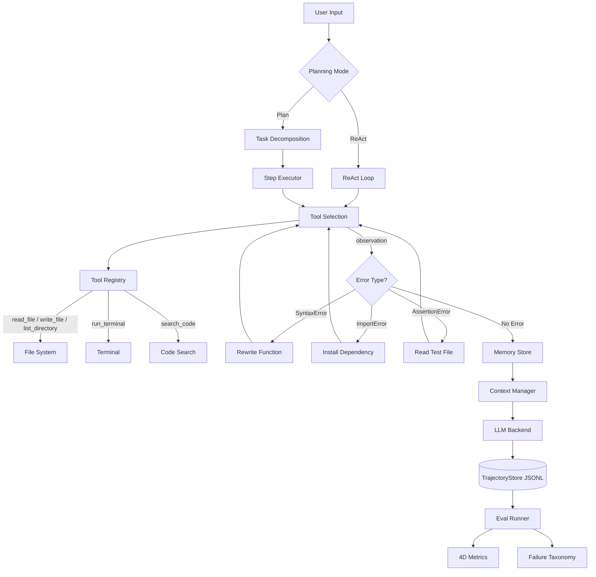

# Coder-Agent 完整执行计划 v2.0

> **AI Coding Assistant with ReAct Planning, Tool Use, Self-Correction, and Systematic Evaluation**  
> 不依赖 LangChain，从底层理解每个组件的工作原理。

---

## v2.0 主要改进

| 原计划 | v2.0 新增 |
|--------|-----------|
| ReAct循环（基础） | `is_complete` 字段合并，减少 LLM 调用 |
| 简单错误重试 | 错误分类驱动的差异化修复策略 |
| trajectory 隐式记录 | TrajectoryStore 结构化存储（JSONL） |
| pass@1 单指标 | 4 维评估指标体系 |
| 实验手动管理 | 可复现性保障（seed + git commit） |
| Day 6 才开始 eval 框架 | Day 3 即搭 eval 骨架，提前验证 |
| 定性分析靠人工 | LLM 辅助 failure taxonomy 自动分类 |

---

## 项目定位与架构

### 核心定位

AI Coding Assistant，从底层实现具备 planning、tool use、memory、self-correction 能力的 coding agent，并用标准 benchmark 量化效果。故意不依赖 LangChain/LlamaIndex，全部自实现。

### 目录结构

```
coder_agent/
├── core/
│   ├── llm/           # LLM Backend 抽象层（Local / OpenAI / Anthropic）
│   ├── agent/         # ReAct 主循环
│   └── context/       # Context 管理器（截断 + 摘要）
├── tools/             # 工具注册表 & 5个核心工具实现
├── memory/            # SQLite 持久化 + AST 代码索引
├── eval/              # 评估框架（核心模块）
│   ├── benchmarks/    # HumanEval + 自定义任务 YAML
│   ├── runner/        # EvalRunner（支持单任务/全套/多配置对比）
│   ├── metrics/       # 4维指标计算
│   └── analysis/      # Trajectory 分析 + failure taxonomy
├── cli/               # Click CLI
└── config/            # YAML 配置系统
```

### 总体时间线

| 阶段 | 天数 | 核心内容 | 关键产出 |
|------|------|----------|----------|
| Phase 1 | Day 1–3 | ReAct框架 + 工具 + Self-Correction | ReAct可运行，错误分类修复 |
| Phase 2 | Day 4–5 | Memory与Context管理 | SQLite + AST索引，Context不溢出 |
| Phase 3 | Day 6–8 | Evaluation框架 + 全量实验 | 4维指标，Failure Taxonomy报告 |
| Phase 4 | Day 9–10 | 工程化 + CLI + 文档 | GitHub可demo，README完整 |
| Optional | Day 11–12 | Multi-backend + 博客 | 本地 vs API对比数据 |

---

## Phase 1：ReAct框架 + Tool Use + Self-Correction（Day 1–3）

> 核心：搭建 agent 推理主干，建立错误分类修复机制，并在 Day 3 下午搭好 eval 框架骨架

### Day 1：ReAct 核心循环

#### 上午：ReAct 主循环实现

将现有 Plan 模式升级为 ReAct（边想边做）。**关键改进**：`is_complete` 字段与 thought/action 合并在同一次 LLM 输出中，避免额外的 `check_done` 调用。

```python
# ReAct 单步输出结构
{
  "thought":     "推理当前状态，决定下一步",
  "action":      { "tool": "write_file", "args": {...}, "reason": "..." },
  "is_complete": false,    # 与 thought 合并，无需额外调用
  "final_answer": null     # 完成时填写
}

# 主循环
while not step.is_complete and steps < max_steps:
    step = llm.react_step(task, history)   # 一次调用得到 thought+action+is_complete
    if step.action:
        obs = execute_tool(step.action)
        history.append(step, obs)
    trajectory.record(step)
```

- `max_steps` 设为 15，防止无限循环
- 每步 thought、action、observation 全部写入 TrajectoryStore（见 eval 章节）
- 支持 ReAct 模式 / Plan-Execute 模式通过 config 切换

#### 下午：Structured Tool Calling

LLM 输出严格 JSON 格式，实现 robust 解析（处理截断、换行、多余逗号等边缘情况）：

```python
@dataclass
class ToolCall:
    tool:   str
    args:   dict
    reason: str

@dataclass
class ToolResult:
    success:  bool
    output:   str
    error:    str | None
    duration: float
```

---

### Day 2：工具系统

#### 5 个核心工具

| 工具 | 功能 | 关键约束 |
|------|------|----------|
| `read_file` | 读取文件内容 | 超大文件只返回前 N 行 + 提示 |
| `write_file` | 写入/创建文件 | 自动创建父目录 |
| `run_terminal` | 执行 shell 命令 | timeout 30s，黑名单过滤危险命令 |
| `list_directory` | 查看目录树 | depth 参数，默认 depth=2 |
| `search_code` | grep 搜索代码 | 返回行号 + 上下文 2 行 |

#### 工具注册机制

```python
@tool(name='read_file', description='Read file content')
def read_file(path: str) -> ToolResult:
    ...

# 自动生成 schema 注入 system prompt，类似 function calling
# 支持动态添加/移除工具
```

---

### Day 3：Self-Correction Loop + Eval 骨架

#### 上午：错误分类驱动的修复策略

不同错误类型对应不同修复策略，这个分类本身也是 eval 分析的重要维度：

| 错误类型 | 修复策略 | 典型案例 |
|----------|----------|----------|
| `SyntaxError` | 重写出错函数 | 括号不匹配、缩进错误 |
| `ImportError` | 先 run_terminal 安装依赖 | 缺少第三方包 |
| `AssertionError` | 读取 test 文件理解期望行为再修改 | 边界条件遗漏 |
| `TimeoutError` | 重新规划算法复杂度 | O(n²) 需改为 O(n log n) |
| 逻辑错误 | 分析 traceback + 加 debug print | 成功率最低，约 30% |

- max retry = 3，超出后停止并向用户报告失败原因
- 每次 retry 记录：错误类型、修复策略、是否成功
- 写完代码后自动运行 `py_compile` 检查语法，有 tests 则运行 `pytest`

#### 下午：搭建 Eval 框架骨架（v2 新增）

提前搭好 eval 框架，用简单任务验证 pipeline 正确性，指导后续开发方向：

```python
class EvalRunner:
    def run_task(self, task, agent) -> EvalResult:    ...
    def run_suite(self, tasks, agent) -> SuiteResult: ...
    def compare_configs(self, tasks, configs) -> ComparisonReport: ...
    # compare_configs 直接对应 C1/C2/C3/C4 实验矩阵，一键运行
```

- 骨架搭好后立即跑 1–2 道 HumanEval 题验证流程
- 早期发现 pipeline 问题，避免 Day 6 才暴露

---

## Phase 2：Memory 与 Context 管理（Day 4–5）

> 核心：解决长任务 context 溢出问题，建立跨 session 持久化记忆

### Day 4：Context Window 管理

#### 上午：智能 Context 截断

编码任务 context 极易超出 token 限制。压缩优先级：

| 优先级 | 内容 | 策略 |
|--------|------|------|
| 最高 | 最近的 action / 错误信息 | 完整保留 |
| 高 | 当前 trajectory 的完整步骤 | 保留最近 5 步完整，更早只保留 thought |
| 中 | 文件内容 | 只保留相关片段，非全文 |
| 低 | 早期 history | LLM 一句话摘要替换 |

```yaml
# config.yaml 中配置
context:
  max_tokens: 8000
  summary_threshold: 6000  # 超过此值开始压缩
```

#### 下午：Conversation 摘要

- 对话超过阈值时自动生成「到目前为止做了什么」的摘要
- 摘要替换早期详细 history，保留关键信息：已创建文件、已完成步骤、当前状态
- 摘要生成本身不计入 trajectory（避免污染 eval 数据）

---

### Day 5：Long-term Memory + Codebase Indexing

#### 上午：SQLite 持久化

```sql
-- 三张核心表
CREATE TABLE projects (
    id TEXT PRIMARY KEY, path TEXT, description TEXT,
    tech_stack TEXT, last_accessed TIMESTAMP
);
CREATE TABLE file_summaries (
    project_id TEXT, file_path TEXT, summary TEXT, last_modified TIMESTAMP
);
CREATE TABLE preferences (key TEXT PRIMARY KEY, value TEXT);

-- 新增：实验记录表（eval 专用）
CREATE TABLE experiments (
    experiment_id TEXT, git_commit TEXT, config TEXT,
    timestamp TIMESTAMP, results_path TEXT
);
```

#### 下午：AST-based Codebase Indexing

- 用 Python AST 模块解析 `.py` 文件，提取：类名、函数名、函数签名、docstring
- 存入 `file_summaries`，支持关键词匹配查询
- 不做 embedding 索引（RAG 项目的领域），保持简单

---

## Phase 3：Evaluation 框架（Day 6–8）

> 核心：完整实验矩阵 + 4维指标体系 + Trajectory分析 + Failure Taxonomy

### TrajectoryStore 设计（v2 关键新增）

Eval 分析的数据基础，必须在 Day 3 骨架阶段就确定格式。存为 JSONL，每行一条记录：

```python
@dataclass
class Step:
    step_id:     int
    thought:     str
    action:      dict | None
    observation: str
    timestamp:   float
    token_count: int
    error_type:  str | None   # SyntaxError / ImportError / etc.
    is_retry:    bool

@dataclass
class Trajectory:
    task_id:       str
    experiment_id: str         # 对应实验矩阵配置
    config:        dict        # C1/C2/C3/C4
    steps:         list[Step]
    final_status:  str         # success / failed / timeout
    partial_score: float       # 通过了几个 verification check
    total_tokens:  int
    duration:      float
    git_commit:    str         # 可复现性
    random_seed:   int
```

---

### Day 6：HumanEval 接入

#### 评估 Pipeline

1. 下载 HumanEval（164 道 Python 编程题）
2. 让 agent 生成 solution
3. 运行 provided test cases，记录 pass/fail
4. 计算 pass@1（一次生成即通过的比例）

#### 实验矩阵

| 配置 | Planning | Self-Correction | Memory | 说明 |
|------|----------|-----------------|--------|------|
| C1 | 直接生成 | ✗ | ✗ | 最简基线 |
| C2 | ReAct | ✗ | ✗ | 仅 planning 增益 |
| C3 | ReAct | ✓ (max 3) | ✗ | 加 correction |
| C4 | ReAct | ✓ (max 3) | ✓ | 完整系统 |

在 HumanEval + 自定义任务上都跑一遍，用 `compare_configs` 一键执行。

---

### Day 7：自定义 Multi-step Task Suite

#### 任务设计原则

- 每个任务需要 3–8 步操作，使用多种工具
- 有明确的多级 verification 标准
- 覆盖不同难度：easy / medium / hard

#### 示例任务（10–15 个）

| 任务名 | 难度 | 所需工具 | Verification |
|--------|------|----------|--------------|
| Create REST API | Medium | write, run, read | pytest通过 + curl返回正确状态码 |
| Debug and Fix | Easy | read, write, run, search | pytest test_sort.py 全部通过 |
| Refactor Module | Hard | read, write, list, run | 原文件消失 + 所有原有测试通过 |
| Add Auth to API | Hard | all tools | 未授权返回401，合法token返回200 |
| Write Test Suite | Medium | read, write, run | coverage >= 80% |

```yaml
# 任务定义示例（YAML）
- name: "Debug and Fix"
  description: "The file buggy_sort.py has 3 bugs. Find and fix all of them."
  setup_files: ["buggy_sort.py", "test_sort.py"]
  required_tools: [read_file, write_file, run_terminal, search_code]
  verification:
    - "pytest test_sort.py passes"
  max_steps: 10
  difficulty: easy
```

---

### Day 8：4 维指标体系 + Trajectory 分析

#### 评估指标定义（v2 核心升级）

原计划只有 pass@1，4 维指标组合起来能讲出更深度的故事：

| 指标 | 定义 | 为什么重要 |
|------|------|------------|
| **Task Success Rate** | 最终 verification 全部通过的比例 | 最直观的成功率 |
| **Partial Credit Score** | 通过 k/n 个 verification 的平均比例 | 区分「差一点」和「完全失败」 |
| **Efficiency Score** | `success / steps_used`（越高越好） | 防止用大量步骤勉强完成 |
| **Retry Cost** | correction步骤数 / 总步骤数 | 量化 self-correction 的代价 |

#### 实验可复现性（v2 新增）

```yaml
# 每次实验自动记录
experiment_id: "exp_20240315_C3_001"
git_commit:    "a3f2c1d"
model_config:
  name:        "qwen2.5-coder:7b"
  temperature: 0.2
  seed:        42         # 固定 seed！
task_subset:   [0, 1, 2, ...]
```

#### Failure Taxonomy 自动分类（v2 新增）

对所有 failed case 的 trajectory 用 LLM 自动分类，输出 failure 分布表：

| Failure 类型 | 典型表现 | 占比（示例） |
|--------------|----------|-------------|
| Planning 错误 | 步骤顺序错误，遗漏关键步骤 | ~25% |
| Tool 调用错误 | 参数格式错误、路径不存在 | ~20% |
| 代码逻辑错误 | 算法错误，correction 无法修复 | ~35% |
| Context 丢失 | 重复已完成的步骤 | ~10% |
| 其他/Timeout | 任务过于复杂，超出 max_steps | ~10% |

#### Trajectory 统计指标

- 平均步骤数 per task（按难度分层）
- Tool 调用分布（哪个工具用得最多）
- Self-correction 触发率 & 成功率（按错误类型细分）
- 平均每任务 token 消耗
- 任务完成率 by difficulty level

---

## Phase 4：工程化 + CLI + 文档（Day 9–10）

> 核心：CLI 可用，配置化，GitHub 可 demo

### Day 9：CLI + 配置系统

```bash
# 交互模式
coder-agent chat --model local --project ./my-project

# 单任务模式
coder-agent run "Create a Flask API with user auth" --project ./my-project

# 评估模式
coder-agent eval --benchmark humaneval --output results/
coder-agent eval --benchmark custom --task-dir tasks/ --output results/
coder-agent eval --compare C1,C2,C3,C4 --output results/comparison/

# 查看项目记忆
coder-agent memory --project ./my-project
```

```yaml
# config.yaml
model:
  provider:    local          # local / openai / anthropic
  name:        qwen2.5-coder
  temperature: 0.2
  max_tokens:  4096
  seed:        42             # 固定 seed，保证可复现

agent:
  max_steps:     15
  max_retries:   3
  planning_mode: react        # react / plan-execute
  enable_memory: true

tools:
  terminal_timeout: 30
  blocked_commands: ["rm -rf /", "sudo"]

context:
  max_tokens:        8000
  summary_threshold: 6000
```

---

### Day 10：GitHub 包装

#### README 结构

1. 项目简介 + Architecture Diagram（Mermaid）
2. 功能演示 GIF（asciinema 录制 30 秒 terminal demo）
3. Quick Start（pip install + 3 行代码）
4. Evaluation 结果表格（4 维指标，C1–C4 对比）
5. Failure Taxonomy 分析摘要
6. 设计决策说明（为什么选 ReAct、max retry=3 的依据等）

#### Architecture Diagram



#### 代码质量

- 全面添加 type hints 和 docstrings
- `pyproject.toml` 完善，支持 `pip install -e .`
- `coder-agent --help` 输出清晰
- 关键模块有单元测试

---

## Optional：Day 11–12

### 选项 A：Multi-backend 支持（推荐度：高）

```python
class LLMBackend:
    def generate(self, messages, tools=None) -> Response: ...

class LocalBackend(LLMBackend):     ...   # Ollama / vLLM
class OpenAIBackend(LLMBackend):    ...   # GPT-4o
class AnthropicBackend(LLMBackend): ...   # Claude
```

用不同后端跑 HumanEval，对比本地模型 vs API 模型效果差异——面试时极有话题性。

### 选项 B：Streaming 输出（推荐度：中）

让 agent 的 Thought / Action / Observation 实时流式输出，提升用户体验并方便 debug。

### 选项 C：技术博客（推荐度：高）

「Building a Coding Agent from Scratch: What I Learned About Planning, Tool Use, and Self-Correction」

- 为什么选 ReAct 而非 Plan-Execute
- Self-correction 的成功率与局限性（基于实验数据）
- Context window 管理的实际挑战
- HumanEval 结果与 Failure Taxonomy 分析

---

## 技术栈总结

| 组件 | 选型 | 说明 |
|------|------|------|
| 核心框架 | 纯 Python 自实现 | 不依赖 LangChain，面试加分项 |
| LLM | Ollama + OpenAI/Anthropic API | 统一 LLMBackend 接口 |
| Planning | ReAct（自实现） | 支持与 Plan-Execute 切换 |
| Tool 调用 | 自定义 registry + JSON schema | 装饰器注册，自动生成描述 |
| Memory | SQLite | 跨 session 持久化 + 实验记录 |
| Codebase Index | Python AST 模块 | 提取函数签名 + docstring |
| Context 管理 | tiktoken + 自实现压缩 | 摘要策略 + 优先级截断 |
| Trajectory Store | JSONL 文件 | eval 分析数据基础 |
| CLI | click | 多模式支持 |
| 配置 | PyYAML | 统一配置，seed 保证可复现 |
| 评估 | HumanEval + 自定义 task suite | 4 维指标，自动 failure 分类 |
| 录屏 | asciinema | 生成 terminal demo GIF |

---

## 面试讲述框架（3 分钟版）

**开头（30 秒）**

> 「我从底层构建了一个 AI coding assistant，基于 ReAct 框架实现 planning，支持 5 种工具调用，具备错误分类驱动的 self-correction，并用 4 维指标体系在 HumanEval 和自定义 multi-step 任务上做了系统性评估。」

**技术细节（1 分钟）**

> 「核心是 ReAct 循环——每步 thought/action/is_complete 合并在一次 LLM 调用中，避免额外 round-trip。Self-correction 不是简单重试，而是先分类错误类型（SyntaxError、ImportError、逻辑错误等），针对性地采用不同修复策略。在 HumanEval 上，C1 baseline pass@1 约 X%，C3 开启 self-correction 后提升到 Y%，主要解决的是 SyntaxError 和 AssertionError。」

**深度展示（1 分钟）**

> 「Trajectory 分析发现几个有趣模式：correction 对 TypeError/IndexError 成功率约 80%，对逻辑错误只有约 30%。Failure Taxonomy 显示约 35% 的失败来自代码逻辑错误——这是 self-correction 的天花板。另外 efficiency score 揭示：C4 完整系统虽然 success rate 最高，但在简单任务上 overhead 明显，说明 planning mode 应该根据任务复杂度自适应选择。」

**收尾（30 秒）**

> 「这个项目让我深入理解了 agent 系统的核心挑战：planning 粒度的选择、context window 管理、tool call 可靠性保障，以及——最重要的——如何设计指标体系让评估结果真正有区分度，而不只是一个 pass@1 数字。」
