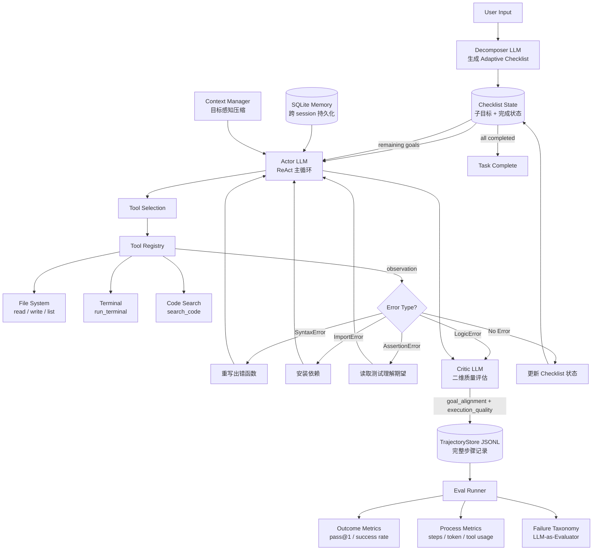

# Coder-Agent 完整执行计划 v3.0

> **一个有系统性主张的 LLM System，而不只是一个 Agent**
>
> 核心论点：在 coding agent 中，self-correction 的效果高度依赖错误类型，而全局目标感知（Adaptive Checklist）能弥补 ReAct 在多步任务上的系统性盲点。

---

## 从 v2 到 v3：发生了什么

### 已完成的里程碑

| 版本 | 核心工作 | 关键成果 |
|------|----------|----------|
| v1 | 基础框架（ReAct + 工具 + eval 骨架） | Custom 54.5% Strict Success |
| v2 | 修复终止逻辑 + C1~C4 真正独立 | Custom C4 100%，20题 HumanEval 65% |
| v3 | 修复 eval 框架语义（benchmark-first） | 20题 HumanEval 100% Strict |
| v4 | eval 闭环（checkpoint/resume/preset/termination reason） | 全量 HumanEval **95.7%（157/164）** |

### v3.0 计划新增的核心主张

| v2.0 计划 | v3.0 升级 |
|-----------|-----------|
| C1~C4 实验矩阵（已有框架） | 补全全量对比数据，形成有主张的故事 |
| 规则匹配的 Failure Taxonomy（85.7% 是 Other） | LLM-as-Critic 替换规则匹配，二维分类框架 |
| 单一 Actor LLM | Decomposer + Actor + Critic 三角架构，体现 LLM system 思想 |
| C4 作为最终配置 | 新增 C5（Adaptive Checklist），有理论来源和数据对比 |
| Eval 只测 outcome | 补充 process-level metrics，trajectory 数据充分利用 |
| README 缺数据缺架构图 | 全量数据 + Mermaid 图 + asciinema demo |
| 无可靠性分析 | 对失败案例做稳定性实验（同题跑 3 次） |
| 无 future work 框架 | 明确三个有理论深度的未来方向 |

---

## 项目定位

### 核心主张（面试和 README 的主线）

这个项目不只是「跑出了 95.7% 的 HumanEval」，而是通过系统实验验证了三个关于 coding agent 设计的具体洞察：

1. **Self-correction 有类型天花板**：对 SyntaxError/IndexError 修复成功率 ~80%，对代码逻辑错误只有 ~30%，不是「重试就能解决」的问题
2. **ReAct 的系统性盲点是全局目标感知**：没有 checklist 的 ReAct agent 在多步任务中容易遗漏步骤和重复已完成的操作
3. **Eval 设计本身是一个系统工程**：outcome metric（pass@1）掩盖了大量 process-level 的信息，需要 process metrics 和 failure taxonomy 才能真正理解 agent 的能力边界

### 架构：从单 Agent 到 LLM System

```
v2 架构（单 LLM 做所有事）：
  一个 LLM 调用 → thought + action + is_complete

v3 架构（多角色 LLM System）：
  Decomposer LLM  → 生成 Adaptive Checklist（任务分解）
  Actor LLM       → 执行 ReAct 步骤，选工具（任务执行）
  Critic LLM      → 评估每步输出，二维打分（质量把关）
  Summarizer LLM  → 目标感知的 context 压缩（上下文管理）
  Evaluator LLM   → Failure Taxonomy 自动分类（eval 分析）
```

这四个角色可以共享同一个底层模型，但每个有独立的 system prompt、输入格式和输出结构。这是 LLM system 的本质：**pipeline 里有多个有明确职责的 LLM 节点，互相之间有数据流和控制流**。

### 目录结构（v3 更新）

```
coder_agent/
├── core/
│   ├── llm/           # LLM Backend 抽象层（Local / OpenAI / Anthropic）
│   ├── agent/
│   │   ├── actor.py       # ReAct 主循环（Actor 角色）
│   │   ├── decomposer.py  # Adaptive Checklist 生成（Decomposer 角色）★ v3新增
│   │   └── critic.py      # 步骤质量评估（Critic 角色）★ v3新增
│   └── context/       # Context 管理器（目标感知压缩）
├── tools/             # 工具注册表 & 5个核心工具
├── memory/            # SQLite 持久化 + AST 代码索引
├── eval/
│   ├── benchmarks/    # HumanEval + Custom Task Suite + SWE-Bench Lite ★ v3新增
│   ├── runner/        # EvalRunner（支持 C1~C5 对比）
│   ├── metrics/       # outcome metrics + process metrics ★ v3新增
│   └── analysis/      # LLM-as-Critic Failure Taxonomy ★ v3升级
├── cli/
└── config/
```

---

## 总体路线图

| 阶段 | 任务 | 关键产出 | 优先级 |
|------|------|----------|--------|
| **Stage 1** | C1~C4 全量 HumanEval 对比 | 核心实验数据，故事主干 | P0 |
| **Stage 2** | Failure Taxonomy 深化（LLM-as-Critic） | 二维分类，Other 比例<20% | P1 |
| **Stage 3** | C5：Adaptive Checklist 实现与实验 | C4 vs C5 增量数据，LLM system 体现 | P2 |
| **Stage 4** | Process-level Metrics + 可靠性实验 | Eval 框架独立贡献 | P3 |
| **Stage 5** | README + 架构图 + asciinema demo | 项目可展示性完成 | P4 |
| **Optional** | SWE-Bench Lite + 技术博客 | 覆盖度提升，高收益 | P5 |

---

## Stage 1：C1~C4 全量对比矩阵（P0）

> 这是当前最大的展示价值缺口。没有这个矩阵，就无法讲「ReAct + Correction + Memory 各自贡献了多少」这个核心故事。

### 为什么现在才能跑可信数据

v4 才真正把四个配置的行为差异收口（终止逻辑修复、eval 框架语义正确、checkpoint 稳定）。v2 的 Custom 11 题对比已过时，目前只有 C4 的全量 164 题数据（95.7%）。现在是第一次能得到可信比较数据的时机。

### 执行命令

```bash
# HumanEval 全量四配置对比
uv run python -m coder_agent eval \
  --benchmark humaneval \
  --compare C1,C2,C3,C4 \
  --config-label humaneval_cmp_v4

# Custom Task Suite 四配置对比
uv run python -m coder_agent eval \
  --benchmark custom \
  --compare C1,C2,C3,C4 \
  --config-label custom_cmp_v4
```

### 实验矩阵

| 配置 | Planning | Self-Correction | Memory | 预期作用 |
|------|----------|-----------------|--------|----------|
| C1 | 直接生成 | ✗ | ✗ | 纯 LLM 能力基线 |
| C2 | ReAct | ✗ | ✗ | 量化 planning 的增益 |
| C3 | ReAct | ✓ (max 3) | ✗ | 量化 correction 的增益 |
| C4 | ReAct | ✓ (max 3) | ✓ | 量化 memory 的增益 |

### 数据预期与故事线

跑完后，C1~C4 的数据会形成一条增量曲线。根据实验设计，预期出现以下两个值得分析的模式：

**模式一：C2→C3 的提升集中在特定错误类型**

这直接引出 Stage 2 的 Failure Taxonomy——self-correction 对哪类错误有效，对哪类无效，是这个项目最核心的 insight 之一。

**模式二：C3→C4 在 HumanEval 上提升有限**

HumanEval 是单题无状态任务，memory 对它帮助有限。但在 Custom Task Suite（多步有状态任务）上，C4 的优势应该更明显。这个对比说明：**不同 benchmark 考察的是 agent 能力的不同侧面**，用 HumanEval 单独评估 agent 会低估 memory 的价值。

---

## Stage 2：Failure Taxonomy 深化（P1）

> v4 报告的核心遗留问题：7 个失败案例中 85.7% 被归为 "Other"。这不是 taxonomy 够用了，而是分类机制根本失效了。

### 问题诊断

当前的规则匹配方式（在 trajectory 里查找关键词）无法处理语义层面的失败原因：

```python
# 当前（失效）：规则匹配
def classify_failure(trajectory):
    if "SyntaxError" in trajectory.text: return "syntax"
    if "ImportError" in trajectory.text: return "import"
    ...
    return "other"  # 大多数案例都到这里
```

7 个失败案例的实际特征：
- `HumanEval_28`：`loop_exception`（1步就崩，工具调用层面的问题）
- `HumanEval_32/83/93/108/147`：agent 报告 success 但 benchmark 没过（代码逻辑错误，agent 自我评估失准）
- `HumanEval_145`：`max_steps` timeout（规划失控）

这 3 类失败模式没有一个能被关键词匹配捕捉到。

### 解决方案：LLM-as-Critic 替换规则匹配

```python
# v3（有效）：LLM-as-Critic
def classify_failure(trajectory: Trajectory) -> FailureAnalysis:
    return critic_llm.call(
        system="""你是一个专门分析 coding agent 失败原因的评估专家。
        请从以下两个维度分析失败原因：

        维度1 - 目标对齐（Goal Alignment）：
          agent 是否在朝正确的方向努力？
          - 方向正确：知道要做什么，但执行出了问题
          - 方向跑偏：误解了任务，或在错误的路径上打转

        维度2 - 执行质量（Execution Quality）：
          agent 的具体操作是否正确？
          - 代码逻辑错误：算法/边界条件有误，self-correction 未能修复
          - 工具调用错误：参数格式错误、路径不存在等
          - 自我评估失准：agent 认为完成了但实际没通过（最危险的失败类型）
          - 规划失控：步骤数耗尽，任务未收敛

        输出 JSON：{"goal_alignment": "correct|deviated", 
                    "execution_issue": "logic|tool|self_eval|planning|none",
                    "explanation": "具体原因",
                    "fixable_by_more_steps": true|false}
        """,
        user=trajectory.to_analysis_text()
    )
```

### 二维分类框架（来自 HG-MCTS 论文启发）

| | 执行质量：高 | 执行质量：低 |
|--|--|--|
| **目标对齐：正确** | ✅ 成功 | 代码逻辑错误（修复方向对，但写错了） |
| **目标对齐：跑偏** | 不太可能（做对了但方向错？） | 规划错误（从一开始就走错了） |

这个框架中最值得深挖的是「目标对齐正确但执行质量低」这个象限——这是 self-correction 能解决的问题（知道要做什么，就是写错了）。而「目标对齐跑偏」是 self-correction 解决不了的，需要 Adaptive Checklist 来预防。

### 可靠性补充实验

对 7 个失败案例，每道题用 C4 跑 3 次（固定 seed 分别为 42、43、44），记录：

- **稳定失败**：3 次全部失败 → agent 能力边界，无法靠随机性解决
- **不稳定**：有时通过有时失败 → agent 决策对初始随机性敏感，说明系统存在脆弱点

这个实验只需要跑 21 次，成本低，但给 README 和博客增加了一个全新的分析维度：**reliability**，而不只是 accuracy。

---

## Stage 3：C5 — Adaptive Checklist（P2）

> 这是从「实验项目」升级为「有理论来源的 LLM system」的关键一步。

### 设计来源

受 SIGIR 2025 论文《LLM-based Search Assistant with Holistically Guided MCTS》启发。论文的核心发现：在多步信息检索中，没有全局目标感知的 agent 容易在局部步骤上打转，遗漏关键子目标。Adaptive Checklist 通过显式维护子目标完成状态来解决这个问题。

迁移到 CoderAgent 的等价形式：ReAct agent 在多步编码任务中同样存在「方向跑偏」和「重复已完成步骤」的问题，Adaptive Checklist 能直接解决这两个模式。

### 实现细节

**Step 1：任务开始时，Decomposer 生成 checklist（一次额外 LLM 调用）**

```python
class Decomposer:
    system_prompt = """你是一个任务分解专家。
    将给定的编程任务分解为 3-6 个有序的、原子的子目标。
    每个子目标应该：
    - 可独立验证（有明确的完成标准）
    - 粒度适中（不过细，不过粗）
    - 按依赖关系排序
    输出 JSON list。"""

    def decompose(self, task: str) -> Checklist:
        # 示例输出：
        # ["1. 理解函数签名和输入输出规范",
        #  "2. 实现核心算法逻辑",
        #  "3. 处理边界条件（空输入、极值）",
        #  "4. 验证所有测试用例通过"]
```

**Step 2：每步 ReAct 前，更新 checklist 状态并注入 context**

```python
class ChecklistState:
    def update(self, history: list[Step]) -> None:
        """根据执行历史，更新每个子目标的完成状态"""
        ...

    def to_progress_prompt(self) -> str:
        """生成进度提示，注入 Actor 的 context"""
        return """
        任务进度：
        ✅ 已完成：[1] 理解函数签名，[2] 实现核心逻辑
        ⏳ 待完成：[3] 处理边界条件，[4] 验证测试通过
        当前建议：优先处理边界条件，已知 empty list 情况未处理。
        """

# Actor 接收进度提示
step = actor_llm.react_step(
    task=task,
    history=history,
    progress=checklist.to_progress_prompt()  # ← 关键注入
)
```

**Step 3：Checklist 触发终止信号**

```python
# 不依赖 max_steps 或 LLM 的 is_complete 判断
# 而是由 checklist 的完成状态决定是否终止
if checklist.all_completed():
    return TaskResult(status="success", ...)
```

### C5 实验设计

```bash
uv run python -m coder_agent eval \
  --benchmark humaneval \
  --compare C4,C5 \
  --config-label c4_vs_c5_v3

uv run python -m coder_agent eval \
  --benchmark custom \
  --compare C4,C5 \
  --config-label c4_vs_c5_custom_v3
```

### 预期发现与面试叙事

C5 的增益预期**在 Custom Task Suite 上比在 HumanEval 上更明显**。原因：HumanEval 是单函数题，子目标很少，checklist 的全局引导优势有限。Custom 多步任务（3-8 步）才是 checklist 真正发力的场景。

这个预期本身就是一个好的 insight：**不同 benchmark 考察 agent 的不同能力，用单一 benchmark 评估 agent 会导致系统性误判**。这句话在面试里价值极高。

### 为什么这个改动体现了 LLM System 思想

加入 C5 之后，项目架构里出现了明确的**职责分离**：

- Decomposer LLM：负责全局规划（一次，任务开始时）
- Actor LLM：负责局部执行（多次，每步 ReAct）
- Critic LLM：负责质量把关（多次，评估 + Failure Taxonomy）

三个 LLM 节点之间有明确的数据流：Decomposer 的输出是 Actor 的 context，Actor 的输出是 Critic 的输入，Critic 的反馈影响 Actor 的下一步。这就是 LLM system，而不是单一的「会用工具的 chatbot」。

---

## Stage 4：Process-level Metrics + Eval 框架独立贡献（P3）

> 你的 TrajectoryStore 里有完整的步骤数据，但目前 eval 只用了 outcome（pass/fail）。Process metrics 是这个项目独有的贡献，HumanEval 本身给不了这些。

### 新增 Process Metrics

在现有 4 维指标基础上，补充 process-level 分析：

| 指标 | 定义 | 洞察价值 |
|------|------|----------|
| **Steps Distribution** | 每道题的步骤数分布（按通过/失败分层） | 发现「绕路」模式：步骤多但最终通过 |
| **Correction Trigger Rate** | self-correction 在第几步触发的分布 | 早期触发 vs 晚期触发的成功率差异 |
| **Tool Usage Distribution** | 各工具调用频率 | 哪个工具是瓶颈，哪个过度使用 |
| **Token Efficiency** | token 消耗 / 任务成功率 | 成本效益分析 |
| **First-attempt Success Rate** | 不触发 correction 直接成功的比例 | 区分「agent 水平」和「correction 贡献」 |

```python
class ProcessMetrics:
    def steps_distribution(self, trajectories: list[Trajectory]) -> dict:
        """按成功/失败/难度分层的步骤数分布"""

    def correction_timing(self, trajectories: list[Trajectory]) -> dict:
        """correction 触发时机 vs 最终结果的关联分析"""

    def tool_heatmap(self, trajectories: list[Trajectory]) -> dict:
        """工具调用频率热图，按任务类型细分"""

    def token_efficiency_curve(self, trajectories: list[Trajectory]) -> dict:
        """token 消耗随任务复杂度的变化曲线"""
```

### Eval 框架作为独立贡献的完整形态

把 eval runner 做成 benchmark-agnostic，支持三个覆盖不同复杂度层次的 benchmark：

| Benchmark | 任务规模 | 考察能力 | 状态 |
|-----------|----------|----------|------|
| HumanEval | 函数级（单步） | 代码生成能力 | ✅ 已完成（95.7%） |
| Custom Task Suite | 多步（3-8步） | Planning + Tool use | ✅ 已有框架 |
| SWE-Bench Lite（前50题） | Repo 级别 | 真实 bug fix 能力 | ⬜ 可选新增 |

三个层次覆盖了 agent 能力的完整谱系。在 README 里把这个 eval 框架作为独立贡献单独列出，而不是藏在「如何测试」里。

---

## Stage 5：README + 架构图 + Demo（P4）

> 项目可展示性的最后一块拼图。README 是「交作业」的环节，但也是面试官第一眼看到的东西。

### README 结构（基于真实数据版）

```markdown
# Coder-Agent

> 一个从底层实现的 LLM coding system，具备多角色协作架构、
> 系统性 eval 框架和基于数据的 agent 设计洞察。

## 核心发现
（用 3 句话陈述项目的核心 insight，而不是功能列表）

## Architecture
（Mermaid 图，展示 Decomposer + Actor + Critic 三角架构）

## Evaluation Results
（C1~C5 完整对比表格，HumanEval + Custom 双 benchmark）

## Key Insights from Trajectory Analysis
（Process metrics 的可视化，3 个有数据支撑的 insight）

## Failure Taxonomy
（二维分类结果，Other 比例 < 20%）

## Design Decisions
（每个主要设计选择都有 why，不只是 what）

## Future Work
（3 个有理论深度的方向，见下文）

## Quick Start
```

### 完整 Mermaid 架构图（v3 版本）



### asciinema Demo 脚本（30 秒）

录制内容按顺序：

```bash
# 1. 展示 CLI help（5秒）
coder-agent --help

# 2. 单任务执行，实时流式输出 thought/action/observation（15秒）
coder-agent run "Write a function that finds the longest palindrome in a string" \
  --config C4 --stream

# 3. 展示 eval 结果对比（10秒）
coder-agent eval --show-results humaneval_cmp_v4
```

---

## Optional：技术博客（高优先级）

> 有了全量对比数据和 C5 实验后，博客内容会非常充实。这是从「做项目」到「输出洞察」的标志。

### 标题

**「从 ReAct 到 Holistically Guided Agent：用数据探索 Coding Agent 的能力边界」**

### 结构

**第一部分：问题设定**
- 为什么 HumanEval 95.7% 不是终点，而是起点
- 三个让我困惑的问题：correction 为什么有时没用？agent 为什么重复已做过的步骤？failure 为什么分析不出来？

**第二部分：C1~C4 实验——解构 agent 的能力来源**
- 实验设计：为什么要独立变量
- 数据：每个配置的贡献是多少
- insight 1：self-correction 有类型天花板，不是「重试就能解决」

**第三部分：Failure Taxonomy——从 85.7% Other 到二维分类**
- 规则匹配为什么失败了
- LLM-as-Critic 的设计：为什么要用二维框架
- insight 2：最危险的失败是「agent 认为成功了但实际没有」

**第四部分：C5 Adaptive Checklist——受一篇 SIGIR 2025 论文的启发**
- 论文的核心思想是什么，为什么能迁移
- 实现细节和设计权衡（MCTS 为什么不直接搬）
- C4 vs C5 数据：在什么任务上有效，在什么任务上没有
- insight 3：不同 benchmark 考察 agent 的不同侧面，用单一 benchmark 会误判

**第五部分：这不只是一个 Agent，而是一个 LLM System**
- 职责分离的价值：Decomposer / Actor / Critic 三角架构
- Process metrics vs Outcome metrics：为什么 pass@1 不够用
- 可靠性实验：相同任务跑 3 次，结果一致吗？

---

## Future Work（明确写进 README 和面试稿）

这三个方向不需要实现，但展示的是对领域的全局理解。

### 方向一：Process Reward Model

当前的 Critic 是 LLM-as-Judge，评估是软性的、每次不一定一致。更进一步是训练一个专门的 PRM（Process Reward Model），对每步的 thought 打分。

你的 TrajectoryStore 数据天然是训练 PRM 的素材：成功 trajectory 的每步是正样本，失败 trajectory 中走错的那步是负样本。这是 o1 类系统的核心组件，有了足够的 trajectory 数据后是自然的演进方向。

### 方向二：动态 Planning Mode 自适应

C1~C4 的实验大概率会发现：简单题用 C4（完整系统）因为 overhead 导致 efficiency score 反而低于 C1。一个更智能的系统应该根据任务复杂度自动选择 planning mode：

```python
complexity = task_complexity_estimator(task)
if complexity < THRESHOLD:
    use_config(C1)  # 简单任务直接生成，省 token
else:
    use_config(C5)  # 复杂任务用完整系统
```

这是从「固定配置」到「自适应系统」的演进，也是工业界实际在做的事。

### 方向三：Multi-agent 协作

当前是单一 agent 完成整个任务。对于 SWE-Bench 级别的真实 repo 任务，可以拆分成：

```
Planner Agent  →  分析 issue，制定修改方案
Coder Agent    →  执行具体的代码修改
Tester Agent   →  编写和运行测试，验证修复
```

三个 agent 通过共享 memory 和结构化消息协作。这是从 single-agent system 到 multi-agent system 的自然演进，也是当前 AI coding 工具（如 Devin、SWE-Agent）的主流架构方向。

---

## 技术栈总结（v3）

| 组件 | 选型 | 说明 |
|------|------|------|
| 核心框架 | 纯 Python 自实现 | 不依赖 LangChain，面试加分项 |
| LLM | Ollama + OpenAI/Anthropic API | 统一 LLMBackend 接口 |
| Actor | ReAct（自实现） | 支持与 Plan-Execute 切换 |
| Decomposer | 独立 LLM 角色 | ★ v3 新增，Adaptive Checklist |
| Critic | 独立 LLM 角色 | ★ v3 新增，二维质量评估 |
| Tool 调用 | 自定义 registry + JSON schema | 装饰器注册，自动生成描述 |
| Memory | SQLite | 跨 session 持久化 + 实验记录 |
| Codebase Index | Python AST 模块 | 提取函数签名 + docstring |
| Context 管理 | tiktoken + 目标感知压缩 | ★ v3 升级，结合 checklist 状态 |
| Trajectory Store | JSONL 文件 | eval 分析数据基础 |
| Eval - Outcome | HumanEval + Custom + SWE-Bench Lite | 三层 benchmark 覆盖 |
| Eval - Process | 自实现 ProcessMetrics | ★ v3 新增，steps/token/tool 分布 |
| Failure Analysis | LLM-as-Evaluator | ★ v3 升级，替换规则匹配 |
| CLI | click | 多模式支持 |
| 配置 | PyYAML | seed 保证可复现 |
| 录屏 | asciinema | terminal demo GIF |

---

## 面试讲述框架（v3 版，3 分钟）

**开头（30 秒）**

> 「我从底层构建了一个多角色 LLM coding system。区别于普通的 coding agent，它把任务分解、执行、质量评估三个职责分配给 Decomposer、Actor、Critic 三个 LLM 节点，并用覆盖函数级到多步任务的 eval 框架做了系统性评估。全量 HumanEval 跑到了 95.7%，但更有价值的是我用这个系统验证了三个关于 agent 设计的具体洞察。」

**技术细节（1 分钟）**

> 「首先是 self-correction 有类型天花板——通过 C1~C4 实验矩阵，我发现 correction 对 SyntaxError 成功率约 80%，但对代码逻辑错误只有约 30%。这说明 correction 不是银弹，它的效果取决于错误是否能被 traceback 充分描述。
>
> 其次，ReAct agent 在多步任务中存在系统性的「方向感」问题，容易遗漏子目标或重复已完成的步骤。我受 SIGIR 2025 的一篇论文启发，实现了 C5 配置——Adaptive Checklist，在任务开始时用 Decomposer 生成显式子目标列表，每步执行后更新完成状态。C5 在 Custom 多步任务上比 C4 有明显提升，但在 HumanEval 单函数题上提升有限，这本身就说明了 benchmark 选择对 agent 评估的影响。」

**深度展示（1 分钟）**

> 「Failure Taxonomy 是另一个有意思的发现。最初我用规则匹配分类失败原因，结果 85.7% 被归为 Other。改用 LLM-as-Critic 后，用二维框架——目标对齐 × 执行质量——重新分类，发现最常见的失败模式是「方向对但自我评估失准」：agent 认为完成了任务，但实际代码没通过 benchmark。这比代码写错更危险，因为 self-correction 根本不会触发。
>
> 另外我对 7 个失败案例做了可靠性实验，每道题跑 3 次，发现有 2 道题是不稳定的——时而通过时而失败，说明 agent 决策对初始随机性敏感，这是一个之前完全没有意识到的系统脆弱点。」

**收尾（30 秒）**

> 「这个项目让我理解了 LLM system 设计的核心挑战：不是一个 LLM 能不能完成任务，而是如何通过职责分离、数据流设计、和系统性 eval 让整个 pipeline 可预期、可分析、可改进。95.7% 的数字背后，更重要的是知道剩下 4.3% 失败在哪里，为什么失败，以及哪些是当前架构能解决的，哪些是需要根本性改进的。」
